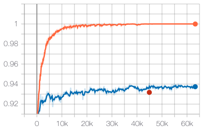
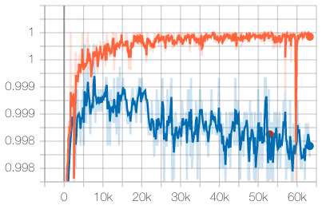

# Exploring Fashion-MNIST with PyTorch

<details><summary>Table of Contents</summary><p>

1. [Installation](https://github.com/LucasVandroux/Fashion-MNIST-PyTorch#installation)
2. [Usage](https://github.com/LucasVandroux/Fashion-MNIST-PyTorch#usage)
3. [Demo](https://github.com/LucasVandroux/Fashion-MNIST-PyTorch#demo)
4. [Experiments](https://github.com/LucasVandroux/Fashion-MNIST-PyTorch#experiments)
5. [Results](https://github.com/LucasVandroux/Fashion-MNIST-PyTorch#results)
6. [Conclusion](https://github.com/LucasVandroux/Fashion-MNIST-PyTorch#conclusion)
7. [Outlook](https://github.com/LucasVandroux/Fashion-MNIST-PyTorch#outlook)

</p></details><p></p>

[Fashion-MNIST](https://github.com/zalandoresearch/fashion-mnist) is a dataset for fashion product classification. It consists of 7'000 images of 10 different classes split in a training dataset of 60'000 images and a testing dataset of 10'000 images. Deep learning models reach ~95% accuracy of the [official benchmark](https://github.com/zalandoresearch/fashion-mnist#benchmark). We want to train models reaching a similar accuracy and being "efficient" enough that they can be used on a regular computer.

We have three different objectives with this exploration:

1. Train different models architectures using different training strategies.
2. Discuss the results of the different experiments.
3. Create a demo to use the trained models with a webcam.


_Different examples of the Fashion-MNIST's classes ([source](https://cran.r-project.org/web/packages/keras/vignettes/tutorial_basic_classification.html))._

## Installation

We recommend using an isolated Python environment, such as [venv](https://docs.python.org/3/library/venv.html) or [conda](https://docs.conda.io/en/latest/) with at least **Python 3.6**. Then, use the following lines of code:

```
git clone https://github.com/LucasVandroux/Fashion-MNIST-PyTorch.git
cd Fashion-MNIST-PyTorch
python3 -m venv .env
source .env/bin/activate
pip install -r requirements.txt
```

### Install PyTorch

As the installation for PyTorch is different for each platform, please have a look at the [PyTorch installation guide](https://pytorch.org/get-started/locally/).

## Usage

Once the installation process is finished, use the `train_fashionMNIST.py` script to reproduce the results of the different experiments.

To get more information about the `train_fashionMNIST.py` script, use the following line in your terminal:

```
python train_fashionMNIST.py --help
```

To use the Demo, see the [Demo](https://github.com/LucasVandroux/Fashion-MNIST-PyTorch#demo) section of this Readme.

### Repository Structure

The repository contains five different folders:

- **data** : this directory will be created when executing the `train_fashionMNIST.py` script for the first time. It will contain the Fashion MNIST's train and test datasets.
- **demo** : this directory contains all the code for the demo.
- **experiments** : this directory will be created when executing the `train_fashionMNIST.py` script for the first time. It will contain the results of the experiments. It is recommended to put the trained models in the directory as well to use them with the demo.
- **images** : this directory contains the images used in this README.
- **models** : this directory contains the architecture of the models and the description of the labels.

## Demo

In order to see how our models would perform on real data, we have created a small demo. This Demo can be used with all the models trained using this repository.


_**Video 1**: The Demo correctly classifying a bag._


_**Video 2**: The Demo correctly classifying an ankle boot._


_**Video 3**: The Demo correctly classifying a t-shirt._

### Install the Demo

To separate the Demo from the rest of the project, we created a different `requirements.txt` file. We recommend using a different isolated Python environment for the Demo. To install it, follow those commands:

```
cd demo
python3 -m venv .env
source .env/bin/activate
pip install -r requirements
```

If using a new Python environment, please have a look at the [PyTorch installation guide](https://pytorch.org/get-started/locally/) to reinstall PyTorch.

### Launch the Demo

Once the Demo is installed, download the [trained models](https://github.com/LucasVandroux/Fashion-MNIST-PyTorch/releases/tag/v1) and place them in the ` experiments``folder. The `experiments` folder might have to be created if it does not exist yet. Finally, launch the Demo with the following command (make sure the name of the model and the path for the weights are the correct ones):

```
python run_inference.py --model SimpleCNNModel --weights_path ../experiments/01_SimpleCNNModel/model_best.pth.tar --display_input --display_fps --device 0
```

Once the Demo is running, press `q` to quit or `n` to use the current frame to reinitialized the reference image for the object segmentation.

The image on the top right is the input image fed into the model for classification. Type `python run_inference.py --help` in the terminal to get more information about the different options of the Demo.

### Limitations

Using a basic object segmentation algorithm to extract the fashion items from the frames is limiting the capacities of the Demo. Indeed, the Demo is very sensitive to changes in lights as it will trigger the automatic exposure of the webcam and decrease the precision of the segmentation algorithm.

Moreover, fashion products in Fashion-MNIST are only from one angle. Therefore, using images from different angles of the same products and including some random rotation in the data augmentation pipeline might greatly improve the accuracy of the model with this Demo.

As a final note, we could use such a Demo to capture more data and improve the robustness and precision of our models.

## Experiments

### Models

We decided to test 2 different model architectures. A simple one that we called **SimpleCNNModel** and a prevalent one nowadays called **ResNet18**. Both models have under 20 million trainable parameters.

#### SimpleCNNModel

We picked the architecture of **SimpleCNNModel** from the [official Fashion MNIST benchmark](https://github.com/zalandoresearch/fashion-mnist#benchmark) as it was simple enough in term of architecture but was performing well enough to be a good baseline.

The **SimpleCNNModel** starts with two convolutional layers using the ReLU activation function, followed by batch normalization and max pooling. Those two layers are initialized using the [Xavier Initialization](http://proceedings.mlr.press/v9/glorot10a/glorot10a.pdf). Then comes a first fully connected layer using the ReLU activation function. Finally, we used a last fully connecter layer to output the ten classes.

The original implementation of the model we based our work on can be found on [@ashmeet13](https://github.com/ashmeet13)'s [github respository](https://github.com/ashmeet13/FashionMNIST-CNN/blob/9b21b5e4b352dc3c0d6b8722392592897f80fcf2/Fashion.py#L244).

#### ResNet18

As a second model, we picked **ResNet18**, one of the smallest ResNet models. The main reason that pushed us to select it is its existing pre-trained version on [ImageNet](http://www.image-net.org/) directly available via [torchvision](https://pytorch.org/docs/stable/torchvision/models.html).

The ResNet architecture has been introduced in the paper [Deep Residual Learning for Image Recognition](https://arxiv.org/pdf/1512.03385.pdf) by K. He in 2015. Instead of sequentially stacking regular convolutional layers followed by their activation functions, a ”shortcut” or ”skip-connection” is introduced over one or more layers. This architecture is particularly useful because it is easier for such a module to learn an identity mapping than it is for a model built by simply stacking a series of nonlinear functions. The 18 in **ResNet18** stands for the number of residual components stacked on each other to build the backbone of the model. Finally, we added a fully connected layer to output the ten classes.

As we wanted to use the **ResNet18** model and its pre-trained weights accessible directly from [torchvision](https://pytorch.org/docs/stable/torchvision/models.html), we had to convert the grayscale Fashion MNIST's image to RGB. We did this by replicating the image over three channels.

### Preprocessing Techniques

We decided to test 2 different preprocessing techniques. The first one uses only a random horizontal flip and a normalization. The second one applies the same transformations as the first one but adds random cropping at the beginning and a random erasing at the end.

 

_**Illustration 1**: different examples of data augmented using only the random horizontal flip and the normalization. (The illustration is scaled up for visualization purpose)_

_**Illustration 2**: different examples of data augmented using random cropping, random horizontal flip, normalization, and random erasing. (The illustration is scaled up for visualization purpose)_

#### Random Erasing

Random erasing is a data augmentation technique first described in the paper [Random Erasing Data Augmentation](https://arxiv.org/pdf/1708.04896.pdf) by Z. Zhong in 2017. It consists of randomly selecting a rectangle region of an image and replacing it with random values. This data augmentation technique automatically generates occlusion on the training images. It, therefore, reduces the risk of over-fitting and makes the model more robust to occlusion.

PyTorch already has an [official implementation](https://pytorch.org/docs/stable/torchvision/transforms.html#torchvision.transforms.RandomErasing) of this data augmentation method that has almost identical parameters as the one used in the [official repository of the paper](https://github.com/zhunzhong07/Random-Erasing). Therefore, we decided to use the default version from PyTorch in our implementation.

### Optimizer & Loss Function

We chose to use the same optimizer and loss function for all the experiments. We decided to use the Stochastic Gradient Descent (SGD) as our optimizer with an initial learning rate of 0.015, a momentum of 0.9, and using the [Nesterov's Accelerated Gradient method](https://www.cs.toronto.edu/~fritz/absps/momentum.pdf). As for our loss function, we used the Cross-Entropy Loss.

### Training

We first randomly split the Fashion MNIST train dataset in two: 90% for the training and 10% for the validation of the model. We then trained each model for 300 epochs and kept the model with the best accuracy on the validation set during those 300 epochs. We decided not to use early stopping as the progress was plodding after 100 epochs but still happening.

To track the progress of the training, we used tensorboard. We tracked the top-1 accuracy, top-5 accuracy, and loss on the training set after each batch and on the validation set after each epoch. Once the 300 epochs finished, we computed the same metrics on the test dataset.

Moreover, we also recorded, on tensorboard, the confusion matrix every time we were collecting the previous metrics on all of the datasets.

The training of all the models was made on a p2.xlarge AWS machine using an Nvidia Tesla K80.

## Results

### Benchmark

| Model          | Pre-trained                           | Preprocessing                                                             | #Trainable Parameters\* | Top-1 Accuracy\* | Inference Time\* | Link                                                                                                                      |
| -------------- | ------------------------------------- | ------------------------------------------------------------------------- | ----------------------- | ---------------- | ---------------- | ------------------------------------------------------------------------------------------------------------------------- |
| SimpleCNNModel | No                                    | Random Horizontal Flip + Normalization                                    | 16'841'802              | 93.38            | 3.657ms          | [:link:](https://github.com/LucasVandroux/Fashion-MNIST-PyTorch/releases/download/v1/01_SimpleCNNModel.zip)               |
| SimpleCNNModel | No                                    | Random Cropping + Random Horizontal Flip + Normalization + Random Erasing | 16'841'802              | 93.51            | 3.737ms          | [:link:](https://github.com/LucasVandroux/Fashion-MNIST-PyTorch/releases/download/v1/02_SimpleCNNModel_RandomErasing.zip) |
| ResNet18       | [ImageNet](http://www.image-net.org/) | Random Horizontal Flip + Normalization                                    | 11'181'642              | 93.17            | 8.504ms          | [:link:](https://github.com/LucasVandroux/Fashion-MNIST-PyTorch/releases/download/v1/03_ResNet18.zip)                     |
| ResNet18       | [ImageNet](http://www.image-net.org/) | Random Cropping + Random Horizontal Flip + Normalization + Random Erasing | 11'181'642              | 92.97            | 8.414ms          | [:link:](https://github.com/LucasVandroux/Fashion-MNIST-PyTorch/releases/download/v1/04_ResNet18_RandomErasing.zip)       |

\***#Trainable Parameters**: Number of trainable parameters in the model.

\***Top-1 Accuracy**: The top-1 accuracy is measured on the Fashion MNIST test set that hasn't been used to train the model.

\***Inference Time**: The inference time was measured over ~500 inferences using the `run_inference.py` script. The inference doesn't includes the preprocessing of the images. The inference was done on a Intel(R) Core(TM) i7-7700HQ CPU @ 2.80GHz.

### Experiment #1: SimpleCNNModel

In the 1st experiment, we combined the **SimpleCNNModel** with minimum preprocessing.

#### Command

Command to reproduce the experiment:

```
python train_fashionMNIST.py --model SimpleCNNModel --experiment_name 01_SimpleCNNModel --num_epochs 300 --num_workers 4 --learning_rate 0.015 --momentum 0.9 --nesterov
```

#### Results

Results on the test dataset with the best model:

| Metric           | Value  |
| ---------------- | ------ |
| #training epochs | 233    |
| accuracy         | 0.9338 |
| accuracy-top5    | 0.999  |
| loss             | 0.4413 |

#### Normalized Confusion Matrix

Normalized Confusion Matrix on the test dataset with the best model:


#### Top-1 Accuracy

Evolution of the top-1 accuracy during training on the _training set_ (`orange`), the _validation set_ (`blue`) and the _test set_ (`red`).


#### Top-5 Accuracy

Evolution of the top-5 accuracy during training on the _training set_ (`orange`), the _validation set_ (`blue`) and the _test set_ (`red`).


#### Loss

Evolution of the loss during training on the _training set_ (`orange`), the _validation set_ (`blue`) and the _test set_ (`red`).


### Experiment #2: SimpleCNNModel + Random Erasing

In the 2nd experiment, we combined the **SimpleCNNModel** with the **Random Erasing** preprocessing technique.

#### Command

Command to reproduce the experiment:

```
python train_fashionMNIST.py --model SimpleCNNModel --experiment_name 02_SimpleCNNModel_RandomErasing --num_epochs 300 --num_workers 4 --learning_rate 0.015 --momentum 0.9 --nesterov --random_crop --random_erasing
```

#### Results

Results on the test dataset with the best model:

| Metric           | Value  |
| ---------------- | ------ |
| #training epochs | 292    |
| accuracy         | 0.9351 |
| accuracy-top5    | 0.9993 |
| loss             | 0.2833 |

#### Normalized Confusion Matrix

Normalized Confusion Matrix on the test dataset with the best model:


#### Top-1 Accuracy

Evolution of the top-1 accuracy during training on the _training set_ (`orange`), the _validation set_ (`blue`) and the _test set_ (`red`).


#### Top-5 Accuracy

Evolution of the top-5 accuracy during training on the _training set_ (`orange`), the _validation set_ (`blue`) and the _test set_ (`red`).


#### Loss

Evolution of the loss during training on the _training set_ (`orange`), the _validation set_ (`blue`) and the _test set_ (`red`).


### Experiment #3: ResNet18

In the 3rd experiment, we combined the **ResNet18** pre-trained on ImageNet with minimum preprocessing.

#### Command

Command to reproduce the experiment:

```
python train_fashionMNIST.py --model ResNet18 --experiment_name 03_ResNet18 --num_epochs 300 --num_workers 4 --learning_rate 0.015 --momentum 0.9 --nesterov --pretrained_weights --convert_to_RGB
```

#### Results

Results on the test dataset with the best model:

| Metric           | Value  |
| ---------------- | ------ |
| #training epochs | 212    |
| accuracy         | 0.9317 |
| accuracy-top5    | 0.9965 |
| loss             | 0.5885 |

#### Normalized Confusion Matrix

Normalized Confusion Matrix on the test dataset with the best model:


#### Top-1 Accuracy

Evolution of the top-1 accuracy during training on the _training set_ (`orange`), the _validation set_ (`blue`) and the _test set_ (`red`).



#### Top-5 Accuracy

Evolution of the top-5 accuracy during training on the _training set_ (`orange`), the _validation set_ (`blue`) and the _test set_ (`red`).


#### Loss

Evolution of the loss during training on the _training set_ (`orange`), the _validation set_ (`blue`) and the _test set_ (`red`).


### Experiment #4: ResNet18 + Random Erasing

In the 4th experiment, we combined the **ResNet18** pre-trained on ImageNet with the **Random Erasing** preprocessing technique.

#### Command

Command to reproduce the experiment:

```
python train_fashionMNIST.py --model ResNet18 --experiment_name 04_ResNet18_RandomErasing --num_epochs 300 --num_workers 4 --learning_rate 0.015 --momentum 0.9 --nesterov --pretrained_weights --convert_to_RGB --random_crop --random_erasing
```

#### Results

Results on the test dataset with the best model:

| Metric           | Value  |
| ---------------- | ------ |
| #training epochs | 249    |
| accuracy         | 0.9297 |
| accuracy-top5    | 0.9985 |
| loss             | 0.359  |

#### Normalized Confusion Matrix

Normalized Confusion Matrix on the test dataset with the best model:


#### Top-1 Accuracy

Evolution of the top-1 accuracy during training on the _training set_ (`orange`), the _validation set_ (`blue`) and the _test set_ (`red`).


#### Top-5 Accuracy

Evolution of the top-5 accuracy during training on the _training set_ (`orange`), the _validation set_ (`blue`) and the _test set_ (`red`).



#### Loss

Evolution of the loss during training on the _training set_ (`orange`), the _validation set_ (`blue`) and the _test set_ (`red`).


## Conclusion

After conducting those four experiments, we want to select the best model to use with the demo. In terms of accuracy, the four models are very close to each other, around 93%. However, in terms of inference speed, the **SimpleCNNModel** architecture is almost three times faster than the **ResNet18**. For most applications, an inference speedup of 3 times is more important than a minor increase in accuracy.

In our experiments, the **Random Erasing** preprocessing technique is bringing a little improvement of the accuracy compared to the simple preprocessing technique but only for the **SimpleCNNModel** architecture. However, it decreases the accuracy by 0.02 points for the Shirt class. The Shirt class is the class with the lowest accuracy for all the experiments. It also slows down the convergence of the models during the training.

In conclusion, based on the observation made earlier, we recommend the use of the **SimpleCNNModel** trained without the **Random Erasing** technique. Indeed, it is the fastest model and the only model with accuracy over 0.8 for all the classes.

## Outlook

The different models we have trained have proven to be sufficient for a simple Demo. However, in a real-life application where the reliability of such a classification task must be close to 100%, better models, training processes, and end-to-end pipelines are needed.

To accelerate the training of the models in the future, limiting the number of epochs to 150 or using early stopping might be a good option as little improvement is made after 150 epochs for every experiment. The training time can be particularly crucial if the models must be retrained regularly, and a difference in the accuracy of less than 0.5 is negligible.

As for improvements on the model architecture, we can recommend next to investigate the [Wide Residual Networks (WRN)](https://arxiv.org/pdf/1605.07146.pdf) that are showing better performance on the [official benchmark](https://github.com/zalandoresearch/fashion-mnist#benchmark). Finally, on the data augmentation side, a new transformation called [F-Mix](https://arxiv.org/pdf/2002.12047.pdf) was used to train one of the models at the top of the [Fashion-MNIST's benchmark](https://paperswithcode.com/sota/image-classification-on-fashion-mnist) on [paperswithcode.com](https://paperswithcode.com).
